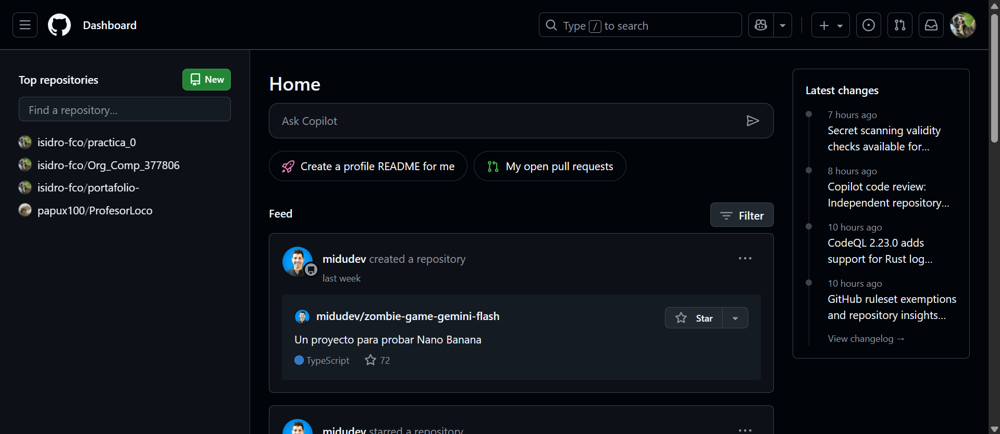
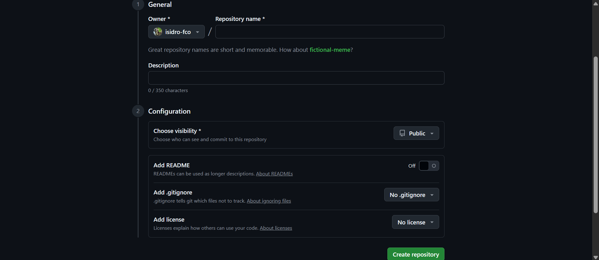
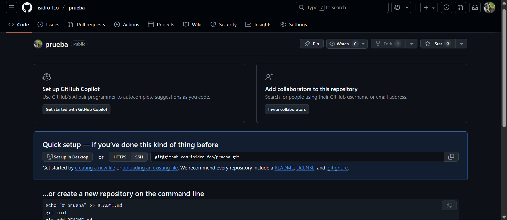
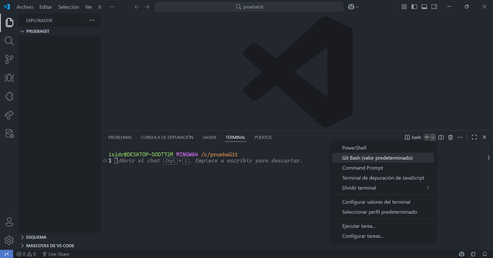

# Práctica 0: Uso de repositorios
###### Isidro Francisco Perez Paz - 377806
---
## MARKDOWN
Markdown es un lenguaje de marcado que facilita la aplicación de formato a un texto empleando una serie de caracteres de una forma especial. En principio, fue pensado para elaborar textos cuyo destino iba a ser la web con más rapidez y sencillez que si estuviésemos empleando directamente HTML.
### Sintaxis
#### Comentarios
```MARKDOWN
<!-- Este es un comentario -->
```
#### Encabezados
```MARKDOWN
# Encabezado 1
## Encabezado 2
### Encabezado 3
#### Encabezado 4
##### Encabezado 5
```
#### Formato de fuentes
```MARKDOWN
<!-- Italicas -->
Este es un texto en *italica*

<!-- Negritas -->
Este es un texto en **negritas**

<!-- Tachado -->
Este es `un texto` ~~tachado~~
```
#### Elementos
```MARKDOWN
* Elemnto 1
* Elemnto 2
* Elemento 3
  * Elemento 3.1
  * Elemnto 3.2
    * Elemento 3.2.1
* Elemnto 4

<!-- OL -->
1. Elemnto 1
1. Elemnto 2
1. Elemento 3
    1. Elemento 3.1
    1. Elemnto 3.2
1. Elemnto 4
```
#### Enlaces
```MARKDOWN
[Texto de enlace](https://www.google.com "Texto del tooltip")
[UABC](http://www.uabc.mx)
[UABC](http://www.uabc.mx "Sitio Univesitario")
```
#### Imagenes
```MARKDOWN


[](http://www.uabc.mx "Sitio Universitario")

[](http://www.vscode.com)
```
#### Bloques de codigo
```MARKDOWN
    ```Python
    print("Hola Mundo!")
    ```

    ```javascript
    console.log("Hola Mundo!")
    const test = ()
    ```

    ```html
    <h1>Hola Mundo</h1>
    ```
```
#### Tablas
```MARKDOWN
|Producto|Precio|Cantidad|
|-|-|-|
|Laptop|3.3|2|
|Mouse|13.3|1|

| Producto | Precio | Cantidad |
|----------|--------|----------|
| Laptop   | 3.3    | 2        |
| Mouse    | 13.3   | 1        |
```
#### Notas
```MARKDOWN
> Esto es una nota.
```
#### Tareas
```MARKDOWN
* [x]Primera tarea
* [ ]Segunda tarea
* [x]Tercera tarea
* [ ]Cuarta tarea
```
#### Separadores horizontales
```MARKDOWN
---
***
___
```
---
## Git y GitHub
**Git:** es un **software de código abierto** que se ejecuta en tu computadora. Su propósito principal es rastrear los cambios en los archivos de un proyecto a lo largo del tiempo. Es lo que se conoce como un **Sistema de Control de Versiones Distribuido (DVCS)**.

**GitHub:** es una **plataforma web que usa la tecnología de Git**. Es un servicio de **alojamiento de repositorios remotos**. **No es Git** en sí mismo, sino un lugar para subir los repositorios de Git y colaborar con otros.
### Como crear tu repositorio y subir tus archivos
>Inicia sesion o crea una cuenta en **GitHub**.
Ya creado tu perfil, vas buscar un **boton verde** que dice **new**.


>Ya dentro introduces el nombre que le quieres poner a tu repositorio.
Al igual que una descripcion (opcional).
Ya que tengas lo anterior vas a pulsar el **boton verde** que dice **Create repository**.


>Te saldra una pagina asi, como la siguente imagen.


>Ahora es turno de usar **Git**, descarga Git y instalalo.
Ya instalado entra a tu carpeta del proyecto con vscode y en la terminal cambia la **Power Shell** a **Git Bash**.



>Inicializa un repositorio Git en esa carpeta.
```Git
git init
```
>Agrega todos tus archivos al área de preparación.
```Git
git add .
```
>Crea el `commit` para guardar los cambios.
```Git
git commit -m "commit version_final3"
```
>Conecta tu repositorio local con el remoto usando la URL de SSH.
```Git
git remote add origin git@github.com:isidro-fco/prueba.git
```
>**Sube tus archivos a GitHub**. Git usará tu clave SSH para autenticarse automáticamente.
```Git
git push -u origin master
```
>Para ver el informe de estado de tus archivos.
```Git
git status
```
---
### Hugo y GitHub Actions
**Hugo:** es un generador de sitios estáticos escrito en el lenguaje de programación Go. Se ha vuelto muy popular debido a su alta velocidad y flexibilidad. Hugo convierte archivos de contenido (generalmente escritos en Markdown) y plantillas en un sitio web completamente estático.

**GitHub Actions:** es una plataforma de integración y entrega continua (CI/CD) directamente integrada en GitHub. Permite automatizar flujos de trabajo en el ciclo de vida del desarrollo de software, como la construcción, prueba y despliegue de aplicaciones.

---
https://github.com/isidro-fco/Paradigmas_Prog