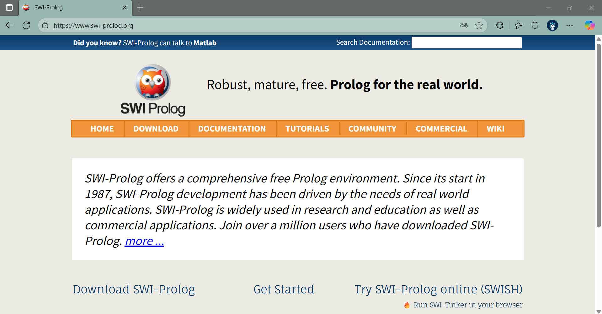
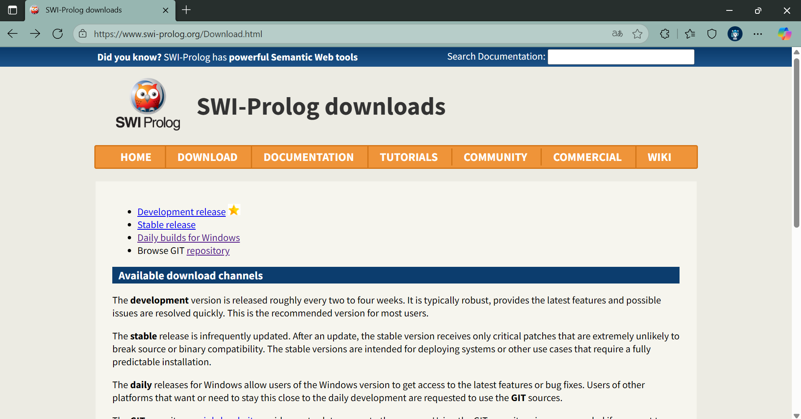
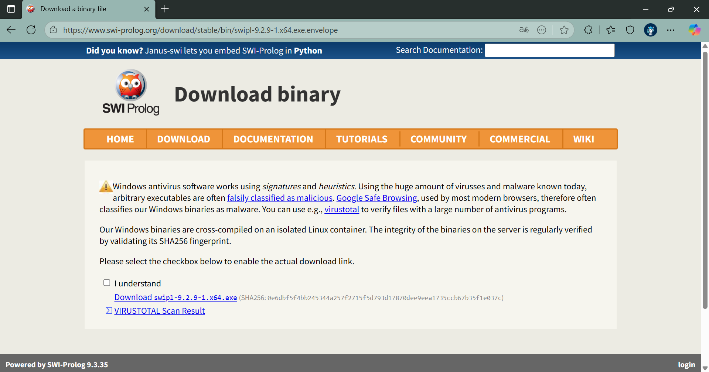

+++
date = '2025-11-24T17:18:59-08:00'
draft = false
title = 'Practica4'
+++
# **Práctica 4: Prolog**
#### **Isidro Francisco Pérez Paz - 377806**
---
## **Instalación del entorno de desarrollo**
Entramos a la página de [Prolog](https://www.swi-prolog.org/).

Ve al apartado de [Download](https://www.swi-prolog.org/Download.html).

Te vas a la opción de [Stable release](https://www.swi-prolog.org/download/stable).
* Selecciona la versión que más se adapte a tu sistema operativo.


Ya que selecciones tu sistema operativo, se te abrirá una pestaña.
* Marca la casilla **I understand**.


Da clic en **Download swipl-9...**

## **Conceptos Básicos**
El paradigma lógico se diferencia fundamentalmente de otros paradigmas (como el funcional) en su estructura. Mientras que la programación funcional se centra en procedimientos y retornos, la programación lógica se basa en una "Base de Conocimiento" y una "Máquina" que procesa "Preguntas" para generar "Respuestas".
En Prolog, los elementos fundamentales son:
1. **Hechos (Facts):** Son afirmaciones incondicionales sobre objetos o relaciones.
   * **Sintaxis:** ```relación(objeto1, objeto2).``` Los nombres de propiedades y objetos deben comenzar con minúscula y terminar con un punto.
   * *Ejemplos:* ```cat(tom).``` (Tom es un gato) o ```loves_to_eat(jorge, pasta).```.
2. **Reglas (Rules):** Definen relaciones condicionales (si-entonces).
   * **Sintaxis:** ```cabeza :- cuerpo.``` Se lee "La cabeza es verdad si el cuerpo es verdad".
   * *Ejemplo:* ```happy(lili) :- dances(lili).``` (Lili es feliz si baila).
3. **Consultas (Queries):** Son preguntas que se hacen a la base de conocimientos para verificar la veracidad de una relación, como ```¿Es Tom un gato?```.
## **Programación Avanzada en Prolog**
**Recursión**
La recursión es vital en Prolog para recorrer estructuras o definir relaciones profundas, como la de "predecesor" (ancestro).
* Caso base: Un padre es un predecesor directo.
* Caso recursivo: Un predecesor es el padre de alguien que a su vez es predecesor del objetivo.

**Objetos de Datos**
Prolog maneja varios tipos de objetos :
* Átomos y Constantes: Cadenas que empiezan con minúscula o entre comillas (```tom```, ```'Hello World'```).
* Variables: Siempre comienzan con letra mayúscula (```X```, ```Y```, ```Resultado```).
* Números: Enteros y reales (```100```, ```2000.45```).

**Operadores y Aritmética**
Se utilizan operadores para comparaciones (```>```, ```<```, ```=:=``` para igualdad numérica) y operaciones aritméticas estándar (```+```, ```-```, ```*```, ```/```, ```mod```) usando la palabra clave ```is``` para la asignación.
* Ejemplo: ```X is 100 + 200.```.

**Estructuras de Control y Listas**
* **Bucles:** Se implementan mediante recursión y condiciones de parada, como contar hasta 10 o un rango ```between(L, H, Y)```.
* **Listas:** Se representan con corchetes ```[a, b, c]```. Se manipulan dividiéndolas en Cabeza (Head) y Cola (Tail) usando la sintaxis ```[Head | Tail]```.
* **Operaciones de Listas:**
    * *Membresía:* ```list_member(X, [X|_]).```.
    * *Concatenación:* Unir dos listas.
    * *Eliminación y Permutación:* Manipulación de elementos dentro de la estructura .

**Predicados Integrados (Built-in)**
El lenguaje incluye predicados útiles para verificar tipos de datos o realizar funciones matemáticas:
* ```var(X)```: Verifica si X es una variable no instanciada.
* ```atom(X)```: Verifica si es un átomo.
* ```random(L,H,X)```: Genera un número aleatorio.

## **Aplicaciones con Prolog**
1. **Backtracking:** El mecanismo por el cual Prolog busca soluciones alternativas cuando falla una rama de ejecución.
2. **Estructuras de Datos Complejas:** Implementación de árboles y listas enlazadas.
3. **Resolución de Problemas Lógicos:**
   * *Torres de Hanoi:* Algoritmo recursivo clásico.
   * *Circuitos Resistivos:* Cálculo de valores en circuitos.
   * *El mono y el plátano:* Un problema clásico de planificación y estados en inteligencia artificial.

## **Referencias**
>José Carlos Gallegos Mariscal, M. (2025-2). Unidad V El paradigma lógico. https://drive.google.com/file/d/1hgdy11WRojjvF_1wbcxWGkNH5QgwZiSO/view
